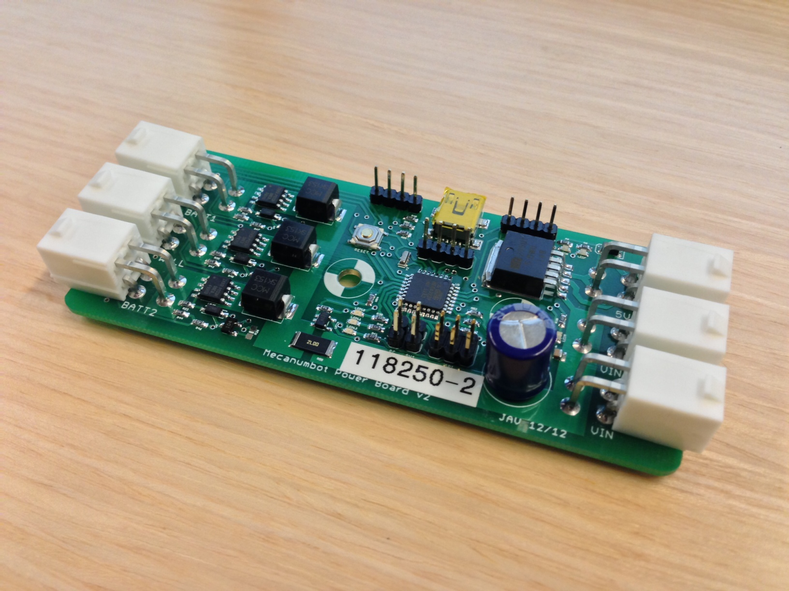

Mecanumbot Power Board
======================

The power board for the Mecanumbot robot.

## Features

* automatically selects between two batteries and the wall
* chooses the wall if available, otherwise drains the batteries one at a time
* provides power voltage and current measuring
* communicates to the primary vehicle Arduino over I2C
* provides regulated 5V power for the robot LEDs
* provides pins for an external switch

See more at http://javconcepts.com/2013/01/06/mecanumbot-power-board/.

## Todo List

* add battery charging
 * the [MAX164*](http://www.maximintegrated.com/datasheet/index.mvp/id/1751) can [allegedly](http://letsmakerobots.com/node/28374?page=1) charge up to a six cell lipo; i'm not sure if that includes balancing the cell or not too
* add fusing
* keep the board / robot powered during microcontroller restart by using flip-flops (useful for loading new code from the robot itself)
 * this could enable comm directly with ROS via USB instead of through I2C through the other Arduino!

## Screenshot

